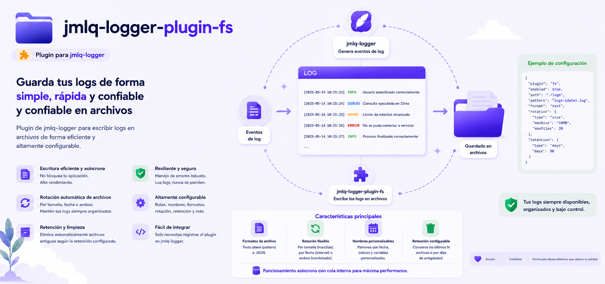

# @jmlq/logger-plugin-fs 🧩



## 🎯 Objetivo

`@jmlq/logger-plugin-fs` es el plugin de persistencia en filesystem para `@jmlq/logger`.  
Su responsabilidad es construir un `ILogDatasource` compatible con el core del logger para:

- escribir logs en archivos,
- rotar archivos según política configurada,
- buscar logs históricos desde archivos `.log`,
- exponer `flush()` sobre el writer del datasource.

El punto de entrada recomendado del paquete es `createFsDatasource(...)`.

## ⭐ Importancia

Este plugin resuelve un escenario muy común en aplicaciones Node.js:

- persistencia local en disco,
- operación simple sin depender de MongoDB o PostgreSQL,
- trazabilidad por archivo diario o por tamaño,
- integración directa con `@jmlq/logger` sin acoplar el host a detalles de `fs`, `path` o streams.

Además, mantiene separación clara entre dominio, casos de uso y adaptadores de Node.js.

## 🏗️ Arquitectura (visión rápida)

- `createFsDatasource(...)` construye el grafo completo del plugin.
- El plugin usa value objects como `FileNamePattern` y `FileRotationPolicy`.
- La escritura real ocurre vía `LogStreamWriterAdapter`.
- La lectura histórica ocurre con `FileSystemLogFileEnumeratorAdapter` y `FileSystemLogFileLineReaderAdapter`.
- El adapter público que se entrega al core es `FsDatasourceAdapter`.

➡️ Ver detalle en: [architecture.md](./docs/es/architecture.md)

## 🔧 Implementación

### 5.1 Instalación

```bash
npm i @jmlq/logger @jmlq/logger-plugin-fs
```

### 5.2 Dependencias

Dependencia directa del plugin:

- `@jmlq/logger`

El plugin usa internamente APIs de Node.js para filesystem/streams, pero esas dependencias no se exponen como configuración del consumidor.

### 5.3 Quickstart (implementación rápida)

Uso directo del plugin:

```ts
import { createLogger } from "@jmlq/logger";
import { createFsDatasource } from "@jmlq/logger-plugin-fs";

const fsDatasource = createFsDatasource({
  basePath: "./logs",
  fileNamePattern: "app-{yyyy}{MM}{dd}.log",
  rotation: { by: "day" },
  mkdir: true,
});

const logger = createLogger({
  datasources: fsDatasource,
});
```

En una capa `infrastructure` del host, una implementación típica queda así:

```ts
import {
  createFsDatasource,
  type IFilesystemDatasourceOptions,
} from "@jmlq/logger-plugin-fs";
import type { ILogDatasource } from "@jmlq/logger";

export class FsAdapter {
  private constructor(private readonly ds: ILogDatasource) {}

  static create(opts: IFilesystemDatasourceOptions): FsAdapter | undefined {
    try {
      const ds = createFsDatasource(opts);
      console.log("[logger] Conectado a FS para logs");
      return new FsAdapter(ds);
    } catch (e: any) {
      console.warn("[logger] FS deshabilitado:", e?.message ?? e);
    }
  }

  get datasource(): ILogDatasource {
    return this.ds;
  }
}
```

### 5.4 Variables de entorno (.env) 📦

El plugin no consume variables de entorno por sí mismo.  
En el host, la configuración real puede resolverse desde `envs.logger`.

Ejemplo de consumo real en un bootstrap del logger:

```ts
fs: envs.logger.LOGGER_FS_PATH
  ? {
      basePath: envs.logger.LOGGER_FS_PATH,
      fileNamePattern: "app-{yyyy}{MM}{dd}.log",
      rotation: { by: "day" },
      mkdir: true,
      onRotate: (oldPath, newPath) => {
        console.log(
          `   [Rotate] Rotación completada: ${oldPath.absolutePath} → ${newPath.absolutePath}`,
        );
      },
      onError: (err) => {
        console.error("   [Error Handler]", err.message);
      },
    }
  : undefined,
```

Variables usadas por ese host para este plugin:

```ts
process.env.LOGGER_FS_PATH;
process.env.LOG_LEVEL;
process.env.LOGGER_PII_ENABLED;
process.env.LOGGER_PII_INCLUDE_DEFAULTS;
```

### 5.5 Helpers y funcionalidades clave

#### `IFilesystemDatasourceOptions`

Configuración pública real del datasource:

```ts
export interface IFilesystemDatasourceOptions {
  basePath: string;
  mkdir?: boolean;
  fileNamePattern?: string;
  rotation?: IFileSystemRotationConfig;
  onRotate?: (oldPath: FilePath, newPath: FilePath) => void | Promise<void>;
  onError?: (error: Error) => void | Promise<void>;
}
```

#### Rotación

El plugin soporta estas políticas:

- `none`
- `day`
- `size`

Ejemplo:

```ts
rotation: { by: "day" }
rotation: { by: "size", maxSizeMB: 50, maxFiles: 10 }
rotation: { by: "none" }
```

#### Patrón de nombre de archivo

El plugin usa `FileNamePattern` y soporta tokens de fecha como:

- `{yyyy}`
- `{MM}`
- `{dd}`

Ejemplo:

```ts
fileNamePattern: "app-{yyyy}{MM}{dd}.log";
```

#### Hooks útiles

- `onRotate`: notificación después de la rotación
- `onError`: centraliza errores del datasource

#### Lectura histórica

El datasource también expone búsqueda de logs usando `find(...)`, apoyado en:

- enumeración de archivos `.log`,
- lectura línea por línea,
- filtrado por nivel, fechas y query textual.

### 5.7 Escenario actual

La integración documentada está orientada a Express y a un bootstrap de infraestructura similar al que ya usas con `@jmlq/logger`, pero el plugin se mantiene desacoplado del framework HTTP.

## ✅ Checklist (pasos rápidos)

- [Instalar](#51-instalación)
- [Crear el datasource con `createFsDatasource`](./docs/es/configuration.md#crear-el-datasource-con-createfsdatasource)
- [Configurar rotación y patrón de nombre](./docs/es/configuration.md#configuración-real-del-datasource)
- [Integrar el datasource en el bootstrap del logger](./docs/es/integration-express.md#bootstrap-del-logger-en-el-host)
- [Adjuntar logger a Express](./docs/es/integration-express.md#adjuntar-logger-al-request)
- [Revisar problemas comunes](./docs/es/troubleshooting.md)

## 🧩 Implementation Example

- [View real integration and documentation](https://github.com/MLahuasi/jmlq-ecosystem/blob/main/doc/es/%40jmlq/logger/fs.md)

## 📌 Menú

- [Arquitectura](./docs/es/architecture.md)
- [Configuración](./docs/es/configuration.md)
- [Integración Express](./docs/es/integration-express.md)
- [Troubleshooting](./docs/es/troubleshooting.md)

## 🔗 Referencias

- [`@jmlq/logger`](https://github.com/MLahuasi/jmlq-logger/blob/main/README.es.md)
- Plugins relacionados del ecosistema:
  - [`@jmlq/logger-plugin-mongo`](https://github.com/MLahuasi/jmlq-logger-plugin-mongo/blob/main/README.es.md)
  - [`@jmlq/logger-plugin-postgresql`](https://github.com/MLahuasi/jmlq-logger-plugin-postgresql/blob/main/README.es.md)

## ⬅️ 🌐 Ecosistema

- [`@jmlq`](https://github.com/MLahuasi/jmlq-ecosystem#readme)
