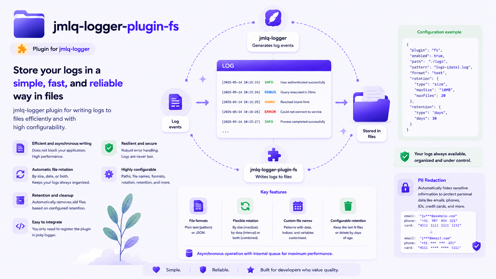

# @jmlq/logger-plugin-fs 🧩



## 🎯 Objective

`@jmlq/logger-plugin-fs` is the filesystem persistence plugin for `@jmlq/logger`.
Its responsibility is to build an `ILogDatasource` compatible with the logger core to:

- write logs to files,
- rotate files based on a configured policy,
- search historical logs from `.log` files,
- expose `flush()` over the datasource writer.

The recommended entry point of the package is `createFsDatasource(...)`.

## ⭐ Importance

This plugin solves a very common scenario in Node.js applications:

- local disk persistence,
- simple operation without depending on MongoDB or PostgreSQL,
- traceability by daily file or by size,
- direct integration with `@jmlq/logger` without coupling the host to `fs`, `path`, or streams details.

It also maintains a clear separation between domain, use cases, and Node.js adapters.

## 🏗️ Architecture (quick view)

- `createFsDatasource(...)` builds the full plugin graph.
- The plugin uses value objects such as `FileNamePattern` and `FileRotationPolicy`.
- Actual writing is performed via `LogStreamWriterAdapter`.
- Historical reading is handled by `FileSystemLogFileEnumeratorAdapter` and `FileSystemLogFileLineReaderAdapter`.
- The public adapter exposed to the core is `FsDatasourceAdapter`.

➡️ See details: [architecture.md](./docs/en/architecture.md)

## 🔧 Implementation

### 5.1 Installation

```bash id="q1c8rt"
npm i @jmlq/logger @jmlq/logger-plugin-fs
```

### 5.2 Dependencies

Direct dependency of the plugin:

- `@jmlq/logger`

The plugin internally uses Node.js APIs for filesystem/streams, but those dependencies are not exposed as configuration for the consumer.

### 5.3 Quickstart (rapid implementation)

Direct plugin usage:

```ts id="u8z3pw"
import { createLogger } from "@jmlq/logger";
import { createFsDatasource } from "@jmlq/logger-plugin-fs";

const fsDatasource = createFsDatasource({
  basePath: "./logs",
  fileNamePattern: "app-{yyyy}{MM}{dd}.log",
  rotation: { by: "day" },
  mkdir: true,
});

const logger = createLogger({
  datasources: fsDatasource,
});
```

In a host `infrastructure` layer, a typical implementation looks like this:

```ts id="v5m2kl"
import {
  createFsDatasource,
  type IFilesystemDatasourceOptions,
} from "@jmlq/logger-plugin-fs";
import type { ILogDatasource } from "@jmlq/logger";

export class FsAdapter {
  private constructor(private readonly ds: ILogDatasource) {}

  static create(opts: IFilesystemDatasourceOptions): FsAdapter | undefined {
    try {
      const ds = createFsDatasource(opts);
      console.log("[logger] Connected to FS for logs");
      return new FsAdapter(ds);
    } catch (e: any) {
      console.warn("[logger] FS disabled:", e?.message ?? e);
    }
  }

  get datasource(): ILogDatasource {
    return this.ds;
  }
}
```

### 5.4 Environment variables (.env) 📦

The plugin does not consume environment variables by itself.
In the host, the actual configuration can be resolved from `envs.logger`.

Example of real usage in a logger bootstrap:

```ts id="t3n9qx"
fs: envs.logger.LOGGER_FS_PATH
  ? {
      basePath: envs.logger.LOGGER_FS_PATH,
      fileNamePattern: "app-{yyyy}{MM}{dd}.log",
      rotation: { by: "day" },
      mkdir: true,
      onRotate: (oldPath, newPath) => {
        console.log(
          `   [Rotate] Rotation completed: ${oldPath.absolutePath} → ${newPath.absolutePath}`,
        );
      },
      onError: (err) => {
        console.error("   [Error Handler]", err.message);
      },
    }
  : undefined,
```

Variables used by that host for this plugin:

```ts id="x7q4yb"
process.env.LOGGER_FS_PATH;
process.env.LOG_LEVEL;
process.env.LOGGER_PII_ENABLED;
process.env.LOGGER_PII_INCLUDE_DEFAULTS;
```

### 5.5 Helpers and key features

#### `IFilesystemDatasourceOptions`

Public datasource configuration:

```ts id="p2z8rk"
export interface IFilesystemDatasourceOptions {
  basePath: string;
  mkdir?: boolean;
  fileNamePattern?: string;
  rotation?: IFileSystemRotationConfig;
  onRotate?: (oldPath: FilePath, newPath: FilePath) => void | Promise<void>;
  onError?: (error: Error) => void | Promise<void>;
}
```

#### Rotation

The plugin supports the following policies:

- `none`
- `day`
- `size`

Example:

```ts id="k9m1hd"
rotation: { by: "day" }
rotation: { by: "size", maxSizeMB: 50, maxFiles: 10 }
rotation: { by: "none" }
```

#### File name pattern

The plugin uses `FileNamePattern` and supports date tokens such as:

- `{yyyy}`
- `{MM}`
- `{dd}`

Example:

```ts id="n4t6zx"
fileNamePattern: "app-{yyyy}{MM}{dd}.log";
```

#### Useful hooks

- `onRotate`: notification after rotation
- `onError`: centralizes datasource errors

#### Historical reading

The datasource also exposes log search via `find(...)`, supported by:

- `.log` file enumeration,
- line-by-line reading,
- filtering by level, dates, and text query.

### 5.7 Current scenario

The documented integration is oriented toward Express and an infrastructure bootstrap similar to what you already use with `@jmlq/logger`, but the plugin remains decoupled from any HTTP framework.

## ✅ Checklist (quick steps)

- [Install](#51-installation)
- [Create datasource with `createFsDatasource`](./docs/en/configuration.md#create-the-datasource-with-createfsdatasource)
- [Configure rotation and file name pattern](./docs/en/configuration.md#datasource-configuration)
- [Integrate datasource into logger bootstrap](./docs/en/integration-express.md#logger-bootstrap-in-the-host)
- [Attach logger to Express](./docs/en/integration-express.md#attach-logger-to-request)
- [Review common issues](./docs/en/troubleshooting.md)

## 🧩 Implementation Example

- [View real integration and documentation](https://github.com/MLahuasi/jmlq-ecosystem/blob/main/doc/en/%40jmlq/logger/fs.md)

## 📌 Menu

- [Architecture](./docs/en/architecture.md)
- [Configuration](./docs/en/configuration.md)
- [Express Integration](./docs/en/integration-express.md)
- [Troubleshooting](./docs/en/troubleshooting.md)

## 🔗 References

- [`@jmlq/logger`](https://github.com/MLahuasi/jmlq-logger#readme)
- Related ecosystem plugins:
  - [`@jmlq/logger-plugin-mongo`](https://github.com/MLahuasi/jmlq-logger-plugin-mongo#readme)
  - [`@jmlq/logger-plugin-postgresql`](https://github.com/MLahuasi/jmlq-logger-plugin-postgresql#readme)

## ⬅️ 🌐 Ecosystem

- [`@jmlq`](https://github.com/MLahuasi/jmlq-ecosystem#readme)
