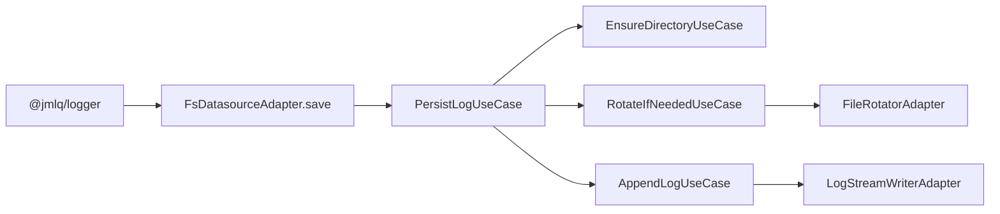
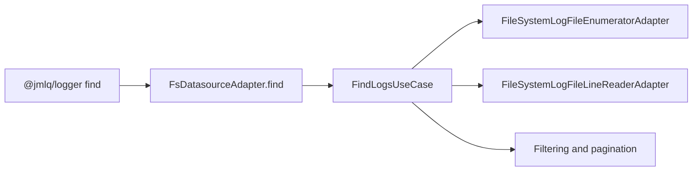
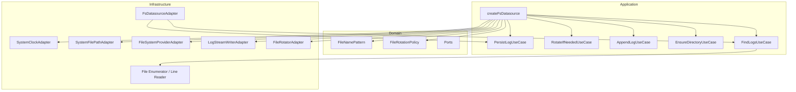

# @jmlq/logger-plugin-fs — Architecture 🏛️

## 🎯 Objective

Explain how `@jmlq/logger-plugin-fs` builds a filesystem datasource compatible with `@jmlq/logger` and how its internal responsibilities are distributed.

## ⭐ Importance

The plugin architecture allows:

- isolating rotation and naming logic,
- decoupling the logger core from concrete Node.js APIs,
- maintaining testability through ports,
- using the plugin as a replaceable datasource.

## 🧱 Main components (what the package exposes)

### Public API

The real entry point is:

```ts
createFsDatasource(options: IFilesystemDatasourceOptions): ILogDatasource
```

### Public configuration

```ts
export interface IFilesystemDatasourceOptions {
  basePath: string;
  mkdir?: boolean;
  fileNamePattern?: string;
  rotation?: IFileSystemRotationConfig;
  onRotate?: (oldPath: FilePath, newPath: FilePath) => void | Promise<void>;
  onError?: (error: Error) => void | Promise<void>;
}
```

### Important Value Objects

- `FileNamePattern`
- `FileRotationPolicy`

### Main use cases

- `EnsureDirectoryUseCase`
- `AppendLogUseCase`
- `RotateIfNeededUseCase`
- `PersistLogUseCase`
- `FindLogsUseCase`

### Main adapters

- `SystemClockAdapter`
- `SystemFilePathAdapter`
- `FileSystemProviderAdapter`
- `LogStreamWriterAdapter`
- `FileRotatorAdapter`
- `FileSystemLogFileEnumeratorAdapter`
- `FileSystemLogFileLineReaderAdapter`
- `FsDatasourceAdapter`

## 🔁 Flows (diagrams)

### Write flow (save)



### Read flow (find)



## 🧩 Clean Architecture (real mapping)



## Real factory implementation

Functional summary based on the actual implementation:

```ts
const fileNamePattern = new FileNamePattern(
  options.fileNamePattern || "app-{yyyy}{MM}{dd}.log",
);

const rotationPolicy = new FileRotationPolicy(
  options.rotation?.by || "day",
  options.rotation?.maxSizeMB,
  options.rotation?.maxFiles,
);

const clock = new SystemClockAdapter();
const filePath = new SystemFilePathAdapter();
const fsProvider = new FileSystemProviderAdapter();
const writer = new LogStreamWriterAdapter();

const fileRotator = new FileRotatorAdapter(
  fsProvider,
  filePath,
  fileNamePattern,
  options.basePath,
);

const ensureDirectoryUseCase = new EnsureDirectoryUseCase(
  fsProvider,
  options.basePath,
  options.mkdir,
);

const appendLogUseCase = new AppendLogUseCase(writer);

const rotateIfNeededUseCase = new RotateIfNeededUseCase(
  fileRotator,
  writer,
  options.onRotate,
);

const persistLogUseCase = new PersistLogUseCase(
  clock,
  fileRotator,
  writer,
  rotationPolicy,
  rotateIfNeededUseCase,
  appendLogUseCase,
  ensureDirectoryUseCase,
  options.onError,
);

return new FsDatasourceAdapter(persistLogUseCase, writer, findLogsUseCase);
```

## ✅ Checklist

- [ ] Define `basePath`
- [ ] Choose `fileNamePattern`
- [ ] Choose rotation policy (`day`, `size`, `none`)
- [ ] Decide if the plugin should create directories (`mkdir`)
- [ ] Implement `onRotate` and `onError` hooks if needed
- [ ] Integrate the datasource into the logger bootstrap

---

## ⬅️ Previous

- [`home`](../../README.md)

## ➡️ Next

- [Configuration](./configuration.md)
- [Express Integration](./integration-express.md)
- [Troubleshooting](./troubleshooting.md)
