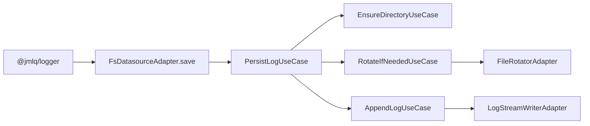
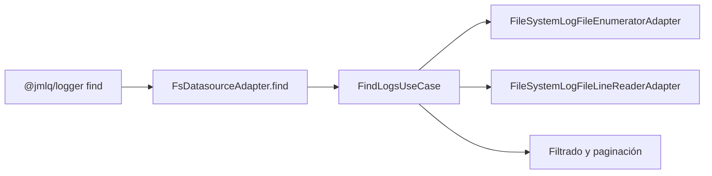
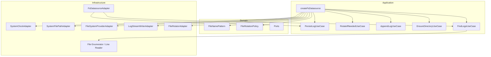

# @jmlq/logger-plugin-fs — Architecture 🏛️

## 🎯 Objetivo

Explicar cómo `@jmlq/logger-plugin-fs` construye un datasource de filesystem compatible con `@jmlq/logger` y cómo se distribuyen sus responsabilidades internas.

## ⭐ Importancia

La arquitectura del plugin permite:

- aislar la lógica de rotación y naming,
- desacoplar el core del logger de APIs concretas de Node.js,
- mantener testabilidad a través de ports,
- usar el plugin como un datasource intercambiable.

## 🧱 Componentes principales (lo que expone el paquete)

### API pública

El punto de entrada real es:

```ts
createFsDatasource(options: IFilesystemDatasourceOptions): ILogDatasource
```

### Configuración pública

```ts
export interface IFilesystemDatasourceOptions {
  basePath: string;
  mkdir?: boolean;
  fileNamePattern?: string;
  rotation?: IFileSystemRotationConfig;
  onRotate?: (oldPath: FilePath, newPath: FilePath) => void | Promise<void>;
  onError?: (error: Error) => void | Promise<void>;
}
```

### Value Objects importantes

- `FileNamePattern`
- `FileRotationPolicy`

### Casos de uso principales

- `EnsureDirectoryUseCase`
- `AppendLogUseCase`
- `RotateIfNeededUseCase`
- `PersistLogUseCase`
- `FindLogsUseCase`

### Adaptadores principales

- `SystemClockAdapter`
- `SystemFilePathAdapter`
- `FileSystemProviderAdapter`
- `LogStreamWriterAdapter`
- `FileRotatorAdapter`
- `FileSystemLogFileEnumeratorAdapter`
- `FileSystemLogFileLineReaderAdapter`
- `FsDatasourceAdapter`

## 🔁 Flujos (diagramas)

### Flujo de escritura (save)



### Flujo de búsqueda (find)



## 🧩 Clean Architecture (mapeo real)



## Implementación real de la factory

Resumen funcional basado en la implementación real:

```ts
const fileNamePattern = new FileNamePattern(
  options.fileNamePattern || "app-{yyyy}{MM}{dd}.log",
);

const rotationPolicy = new FileRotationPolicy(
  options.rotation?.by || "day",
  options.rotation?.maxSizeMB,
  options.rotation?.maxFiles,
);

const clock = new SystemClockAdapter();
const filePath = new SystemFilePathAdapter();
const fsProvider = new FileSystemProviderAdapter();
const writer = new LogStreamWriterAdapter();

const fileRotator = new FileRotatorAdapter(
  fsProvider,
  filePath,
  fileNamePattern,
  options.basePath,
);

const ensureDirectoryUseCase = new EnsureDirectoryUseCase(
  fsProvider,
  options.basePath,
  options.mkdir,
);

const appendLogUseCase = new AppendLogUseCase(writer);

const rotateIfNeededUseCase = new RotateIfNeededUseCase(
  fileRotator,
  writer,
  options.onRotate,
);

const persistLogUseCase = new PersistLogUseCase(
  clock,
  fileRotator,
  writer,
  rotationPolicy,
  rotateIfNeededUseCase,
  appendLogUseCase,
  ensureDirectoryUseCase,
  options.onError,
);

return new FsDatasourceAdapter(persistLogUseCase, writer, findLogsUseCase);
```

## ✅ Checklist

- [ ] Definir `basePath`
- [ ] Elegir `fileNamePattern`
- [ ] Elegir política de rotación (`day`, `size`, `none`)
- [ ] Decidir si el plugin debe crear directorios (`mkdir`)
- [ ] Implementar hooks `onRotate` y `onError` si hacen falta
- [ ] Integrar el datasource en el bootstrap del logger

---

## ⬅️ Anterior

- [`inicio`](../../README.es.md)

## ➡️ Siguiente

- [Configuración](./configuration.md)
- [Integración Express](./integration-express.md)
- [Troubleshooting](./troubleshooting.md)
